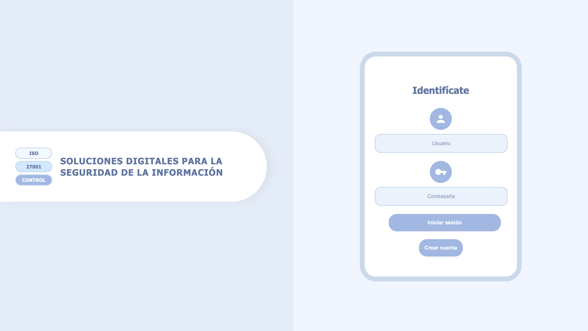
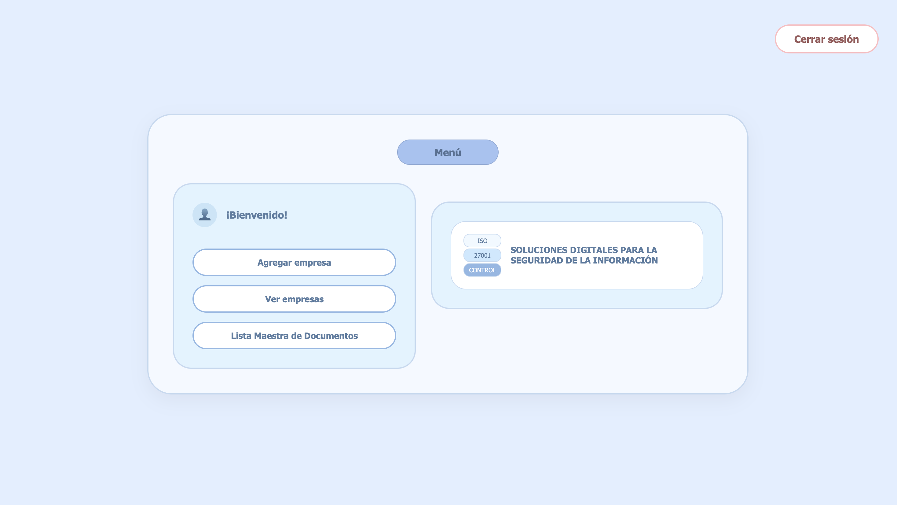
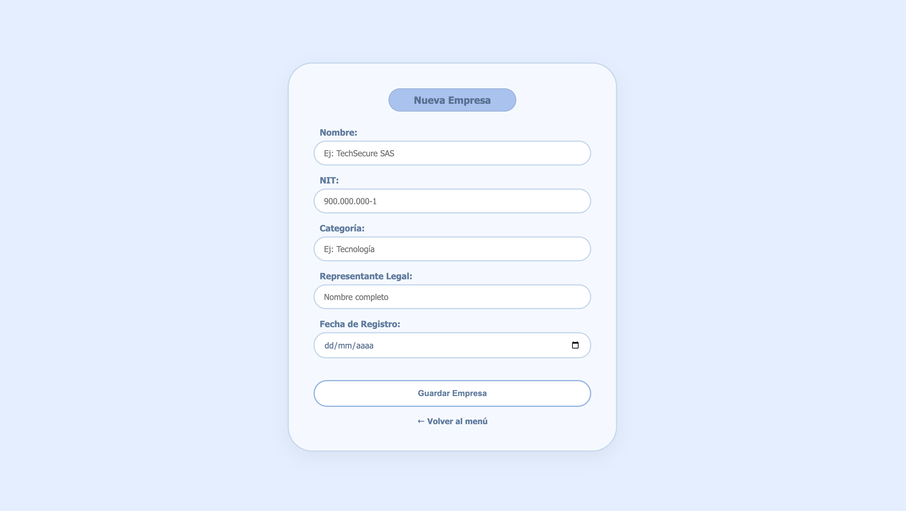
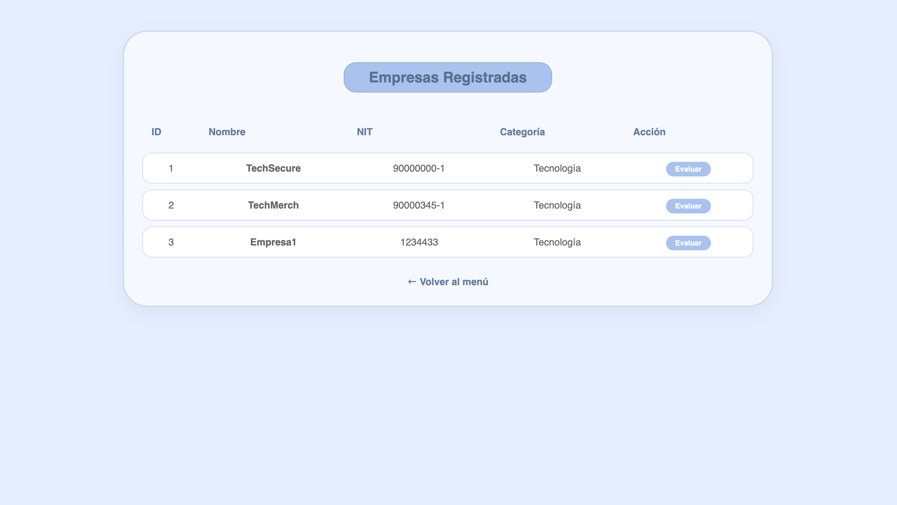
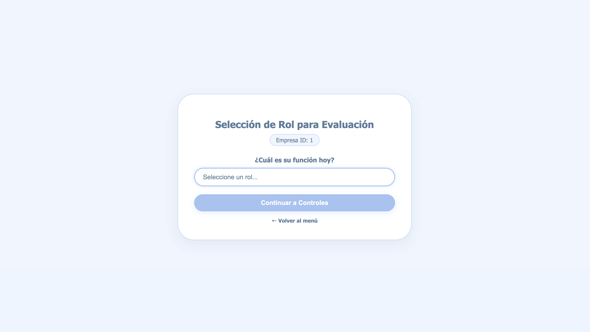
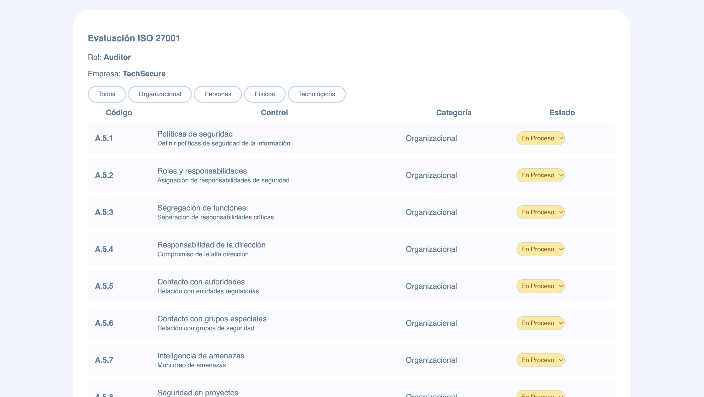
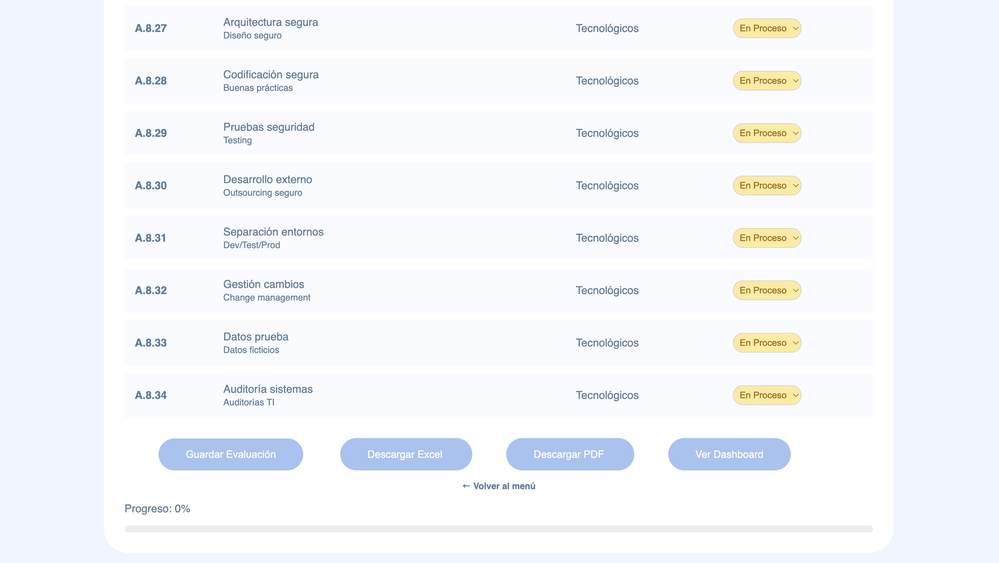
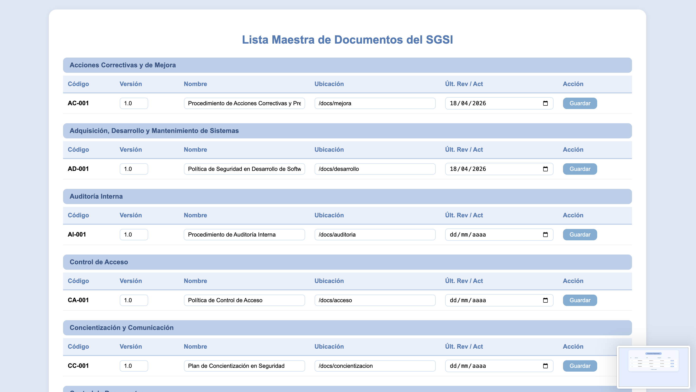

<div align="center">

# Sistema de Auditoría ISO 27001

**Plataforma web para la gestión y evaluación de controles de seguridad de la información**

[](https://python.org)
[](https://djangoproject.com)
[](https://sqlite.org)
[](https://www.iso.org/isoiec-27001-information-security.html)

</div>

---

##  Descripción

Sistema web desarrollado en **Django** y **Python** para gestionar auditorías de seguridad de la información bajo el estándar **ISO/IEC 27001**. Permite registrar empresas, evaluar controles de seguridad, visualizar dashboards de cumplimiento y generar reportes en PDF y Excel.

> Desarrollado como proyecto académico y de portafolio profesional.

---

## Demo

<!-- Sube tu video a YouTube y reemplaza VIDEO_ID con el id del video -->
[](https://youtu.be/0bS4qOZti9Q)

> Haz clic en la imagen para ver la demo completa

---

## Funcionalidades

| Módulo | Descripción |
|---|---|
| **Autenticación** | Login, registro y gestión de sesiones de usuario |
| **Empresas** | Registro y administración de empresas auditadas |
| **Evaluación** | Evaluación de controles ISO 27001 por rol |
| **Dashboard** | Visualización de cumplimiento, riesgos y madurez |
| **Reportes** | Exportación de resultados en PDF y Excel |
| **Lista Maestra** | Gestión de documentos del SGSI |

---

## Capturas de pantalla

<!-- Agrega tus capturas en una carpeta /docs/screenshots/ y enlázalas aquí -->
| Login | Evaluación | Crear | Empresas | Rol | Controles | Guardar | Lista Maestra |
    
      
   
---

## Tecnologías utilizadas

- **Backend:** Python 3.11, Django 4.x
- **Base de datos:** SQLite (desarrollo)
- **Reportes:** ReportLab (PDF), openpyxl (Excel)
- **Frontend:** HTML5, CSS3, Bootstrap
- **Control de versiones:** Git & GitHub

---

## Instalación local

### Prerrequisitos
- Python 3.11+
- pip
- Git

### Pasos

```bash
# 1. Clona el repositorio
git clone https://github.com/yulkatesp/Auditoria27001.git
cd Auditoria27001

# 2. Crea y activa el entorno virtual
python -m venv venv
source venv/bin/activate        # Mac/Linux
venv\Scripts\activate           # Windows

# 3. Instala las dependencias
pip install -r requirements.txt

# 4. Aplica las migraciones
python manage.py migrate

# 5. Crea un superusuario
python manage.py createsuperuser

# 6. Inicia el servidor
python manage.py runserver
```

Abre tu navegador en `http://127.0.0.1:8000`

---

## Estructura del proyecto

```
Auditoria27001/
│
├── auditoria/               # App principal
│   ├── templates/           # Plantillas HTML
│   ├── models.py            # Modelos: Empresa, Control, Evaluacion
│   ├── views.py             # Lógica de negocio
│   └── urls.py              # Rutas de la app
│
├── config/                  # Configuración Django
│   ├── settings.py
│   └── urls.py
│
├── manage.py
└── requirements.txt
```

---

## Flujo de la aplicación

```
Login → Menú → Registrar Empresa → Seleccionar Rol
     → Evaluar Controles ISO 27001
     → Dashboard de Resultados
     → Exportar Reporte PDF / Excel
```

---

## Autora

**Katerin Espitia** — Desarrolladora del proyecto

[](https://github.com/yulkatesp)

---

## Licencia

Este proyecto está bajo la licencia MIT. Consulta el archivo [LICENSE](LICENSE) para más detalles.

---

<div align="center">
  <sub>Hecho con Python y Django</sub>
</div>
